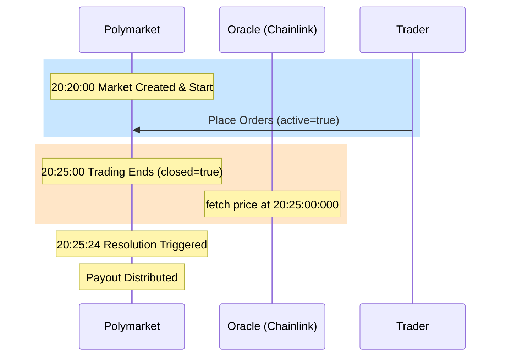

# PM-1: Market Structure & Lifecycle 調查報告

## 1. 5m Market 完整生命週期 (Lifecycle)

根據 API 資料分析，BTC 5m 市場的生命週期如下：

- **開盤時間 (Start Time):** 每 5 分鐘整點（如 20:20:00, 20:25:00 UTC）。
- **交易窗口:** 準確的 5 分鐘。
- **結算時間 (Close/Resolution Time):** 交易窗口結束後約 20-30 秒內完成。例如 20:25:00 結束的市場，通常在 20:25:24 左右由 Chainlink Oracle 觸發結算。
- **狀態轉換:**
    - `accepting_orders: True` (開盤期間)
    - `accepting_orders: False` & `closed: True` (窗口結束)
    - `automaticallyResolved: True` (結算完成)

### Lifecycle Timeline (Example: 20:20-20:25 UTC)

## 2. 相鄰 Market 之間的 Gap

**結論：沒有 Gap，存在連續性。**

分析 `btc-updown-5m-1771618800` (20:20 start) 與 `btc-updown-5m-1771619100` (20:25 start) 發現：前一個市場停止交易的瞬間，下一個市場即處於可交易狀態。兩者在 UTC 20:25:00 準時交接。

## 3. ID 生成邏輯

- **Slug 格式:** `btc-updown-5m-<timestamp>`
- **Timestamp 規律:** 該 Timestamp 為市場 **UTC Start Time** 的 Unix 秒數。
- **預測性:** 可以提前推算下一個市場的 slug（當前 timestamp + 300）和 condition_id（透過 factory 預測，但通常直接從 API 獲取最新 event 即可）。

## 4. 結算條件 (">=" vs ">")

**重要發現：Polymarket 使用 ">=" (含平盤)。**

根據市場描述文件 (Market Description) 明確記載：
> "This market will resolve to 'Up' if the Bitcoin price at the end... is **greater than or equal to** the price at the beginning... Otherwise, it will resolve to 'Down'."

這與 Binance EC（平盤算 lose）有顯著差異。這意味著：
- Polymarket 的 "Up" 勝率比 Binance 的 "Higher" 高出一點點（在平盤頻發期有顯著差異）。
- 我們現有的 `labeling.py` 邏輯需要為 Polymarket 獨立維護。

## 5. 其他時間框架市場 (15m, 1h, 1d)

- **15m Market:** 結構與 5m 相同，slug 為 `btc-updown-15m-<timestamp>`，每 15 分鐘交接。
- **1h/1d Market:** 較少見，通常存在於更長期的預測中（如 "Price at end of week"），但 `btc-updown` 系列目前以 5m/15m 為主。
- **交易窗口:** 分別為 15 分鐘、1 小時。

## 6. 上線時間與 Beta 狀態

- **Series Created At:** 2025-11-21
- **狀態:** 目前已脫離 beta 進入穩定運行期。24 小時交易量顯著 (>$30M)。
- **安全性:** 使用 CLOB 結構，並非早期的 AMM，流動性由專業 Market Makers 提供。

## 7. Chainlink Oracle 結算精度

- **Data Stream:** 使用 Chainlink BTC/USD Real-time Data Stream。
- **精度:** 該 Stream 提供高頻價格更新（毫秒級），結算價通常帶有 8-10 位小數（如 67719.72628788）。
- **透明度:** 結算參考價 (priceToBeat) 在市場開盤時即鎖定並在 `eventMetadata` 中公開。

---

## 總結表格

| 維度 | 規格 | 備註 |
|---|---|---|
| 時間框架 | 5m / 15m | 連續滾動 |
| 結算條件 | `>=` | 平盤算 Up |
| 費用公式 | `crypto_15_min` 型 | Taker 收費, Maker 返利 |
| 數據源 | Chainlink Oracle | 脫離 Binance Index 限制 |
| ID 預測 | 可 (timestamp-based) | 利於自動化策略提前掛單 |
